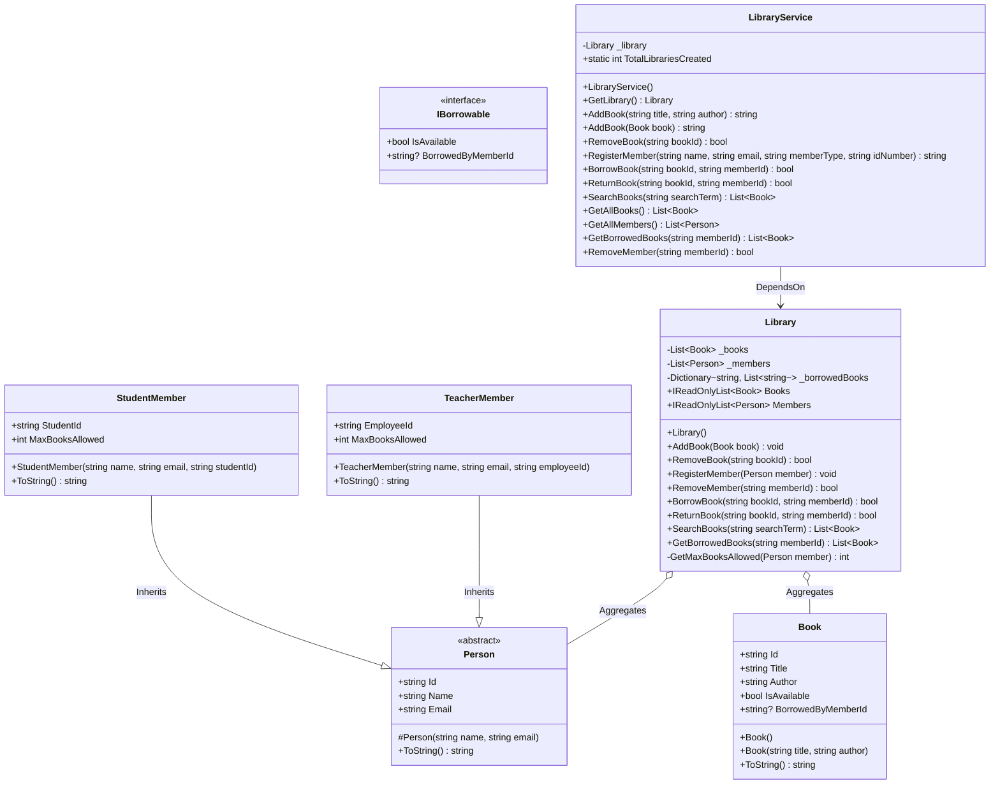

# UML Class Diagram

This document contains the UML Class Diagram for the Library Management System, generated from the source code.

```mermaid
classDiagram
    %% Abstract Base Class
    class Person {
        <<abstract>>
        +string Id
        +string Name
        +string Email
        #Person(string name, string email)
        +ToString() string
    }

    %% Derived Classes
    class StudentMember {
        +string StudentId
        +int MaxBooksAllowed
        +StudentMember(string name, string email, string studentId)
        +ToString() string
    }

    class TeacherMember {
        +string EmployeeId
        +int MaxBooksAllowed
        +TeacherMember(string name, string email, string employeeId)
        +ToString() string
    }

    %% Core Models
    class Book {
        +string Id
        +string Title
        +string Author
        +bool IsAvailable
        +string? BorrowedByMemberId
        +Book()
        +Book(string title, string author)
        +ToString() string
    }

    class IBorrowable {
        <<interface>>
        +bool IsAvailable
        +string? BorrowedByMemberId
    }

    class Library {
        -List~Book~ _books
        -List~Person~ _members
        -Dictionary~string, List~string~~ _borrowedBooks
        +IReadOnlyList~Book~ Books
        +IReadOnlyList~Person~ Members
        +Library()
        +AddBook(Book book) void
        +RemoveBook(string bookId) bool
        +RegisterMember(Person member) void
        +RemoveMember(string memberId) bool
        +BorrowBook(string bookId, string memberId) bool
        +ReturnBook(string bookId, string memberId) bool
        +SearchBooks(string searchTerm) List~Book~
        +GetBorrowedBooks(string memberId) List~Book~
        -GetMaxBooksAllowed(Person member) int
    }

    %% Service Layer
    class LibraryService {
        -Library _library
        +static int TotalLibrariesCreated
        +LibraryService()
        +GetLibrary() Library
        +AddBook(string title, string author) string
        +AddBook(Book book) string
        +RemoveBook(string bookId) bool
        +RegisterMember(string name, string email, string memberType, string idNumber) string
        +BorrowBook(string bookId, string memberId) bool
        +ReturnBook(string bookId, string memberId) bool
        +SearchBooks(string searchTerm) List~Book~
        +GetAllBooks() List~Book~
        +GetAllMembers() List~Person~
        +GetBorrowedBooks(string memberId) List~Book~
        +RemoveMember(string memberId) bool
    }

    %% Relationships
    StudentMember --|> Person : Inherits
    TeacherMember --|> Person : Inherits
    
    Library o-- Book : Aggregates
    Library o-- Person : Aggregates
    
    LibraryService --> Library : DependsOn
    
    %% Note: Book matches IBorrowable signature but doesn't explicitly implement it in code
```
